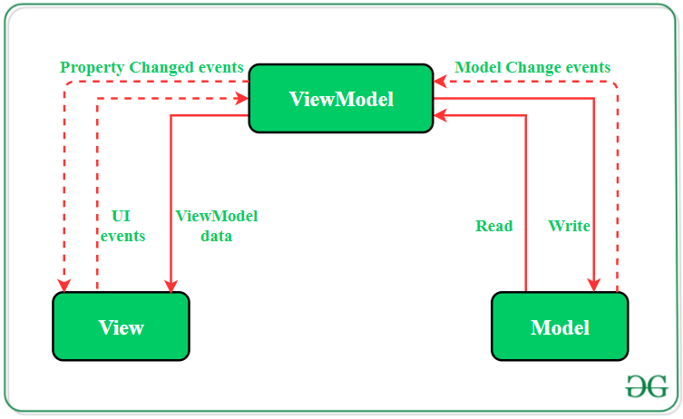
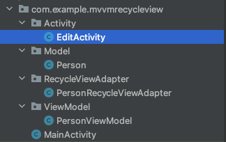
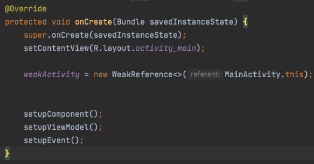
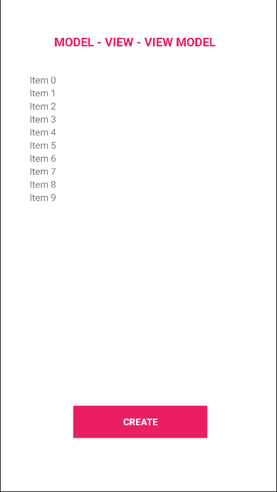
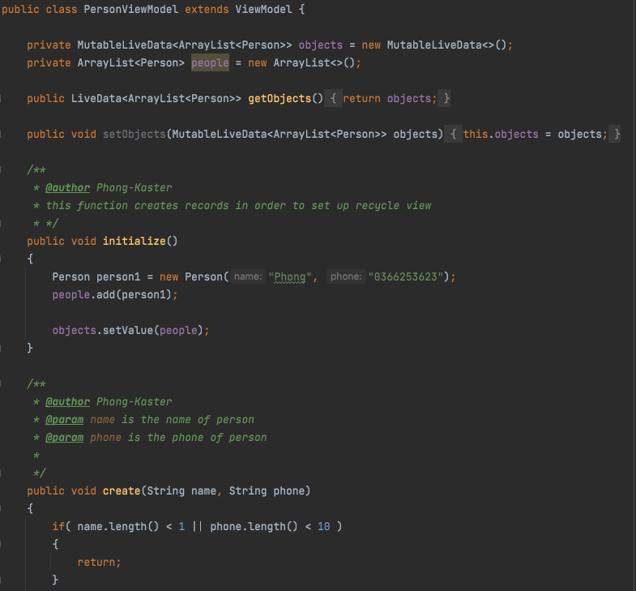

<h1 align="center">Model - View - View Model in Android 
    This is a simple project built on Model-View-ViewModel architectural pattern
</h1>

    

# [**Table Of Content**](#table-of-content)
- [**Table Of Content**](#table-of-content)
- [**Introduce**](#introduce)
- [**What is Model-View-View Model ?**](#what-is-model-view-view-model-)
- [**Directory Structure**](#directory-structure)
- [**Step-By-Step Implementation**](#step-by-step-implementation)
  - [**Step 1: Create A New Project**](#step-1-create-a-new-project)
  - [**Step 2: Create the Model class**](#step-2-create-the-model-class)
  - [**Step 3: Design XML layout for MainActivity**](#step-3-design-xml-layout-for-mainactivity)
  - [**Step 4: Declare PersonViewModel**](#step-4-declare-personviewmodel)
  - [**Step 5: Define functionalities of View in the MainActivity file**](#step-5-define-functionalities-of-view-in-the-mainactivity-file)
- [**Demo**](#demo)
- [**My Mentors**](#my-mentors)
- [**Made with 💘 and Android **](#made-with--and-android-)

# [**Introduce**](#introduce)

First of all, we have to answer a crucial question whenever go in search of anything

**What is design pattern ?**

Design pattern is a general repeatable solution to a commonly occurring problem in software design. Design pattern is not a template or a structure that we have to abide by. However, we couldn't transform directly into code. It is a description or template for how to solve a problem that can be used in many different situations.

There are 3 renewed design pattern when it comes to develop Android programs. They are

- [**MVVM**](#)(*current*)

- [**MVP**](#)

- [**MVC**](#)

It is document I will describe every thing you need to know & understand to take advance of MVVM architecture into a Android application.

# [**What is Model-View-View Model ?**](#what-is-model-view-viewmodel)

Developers always prefer a clean and structured code for the projects. By organizing the codes according to a design pattern helps in the maintenance of the software. By having knowledge of all crucial logic parts of the android application, it is easier to add and remove app features. Further, design patterns also assure that all the codes get covered in Unit Testing without the interference of other classes. 

Model — View — ViewModel (MVVM) is the industry-recognized software architecture pattern that overcomes all drawbacks of MVP and MVC design patterns. MVVM suggests separating the data presentation logic(Views or UI) from the core business logic part of the application. 

    

<h3 align="center">

***There are 3 components in MVVM architectural design***
</h3>

The separating layers of MVVM are:

**MODEL** - The layer takes responsibility for describing objects in a database. For example: There is a student table in our Database so that model has to describe every single property of it

**VIEW** - The purpose of this layer is to inform the ViewModel about the user’s action & define how data will be showed in a XML layout. This layer observes the ViewModel and does not contain any kind of application logic.

**VIEW MODEL** - It plays a role as a middle-man between MODEL and VIEW. It handles logical request and return result to VIEW.

MVVM pattern has some similarities with the MVP(Model — View — Presenter) design pattern as the Presenter role is played by ViewModel. However, the drawbacks of the MVP pattern has been solved by MVVM in the following ways:

1. ViewModel does not hold any kind of reference to the View.

2. Many to 1 relationship exist between View and ViewModel. A view maybe have more than one ViewModel.

3. No triggering methods to update the View.

# [**Directory Structure**](#directory-structure)

The picture shows the project's directory structure in this repository below:

    

<h3 align="center">

***Project's Directory Structure***
</h3>

**Activity** includes MainActivity and EditActivity. Their role is View which shows data to end-users. 

**Model** includes class Person which is describes properties of a Person objects

**RecycleViewAdapter** is the component to create a list of item in screen. It contain files which is utilized to build up ViewHolder & logical flows when we want to use RecycleView.

**ViewModel** consists PersonViewModel where every function used to handle logic lying here.

# [**Step-By-Step Implementation**](#step-by-step-implementation)

## [**Step 1: Create A New Project**](#step-1-create-a-new-project)

Open Android Studio in your PC/Laptop.

Click on File, then New => New Project.

Choose Empty activity

Select language as Java.

Select the minimum SDK as per your need. I chosen Android 7, for instance.

## [**Step 2: Create the Model class**](#step-2-create-the-model-class)

        public class Person {

            private int id;
            private String name;
            private String phone;

            #Constructor....

            #Getter & Setter...
        }

Class `Person` is in charge of ensuring correct format with new person added to database. For instance, a person object only have 3 properties include: id, name, phone. Therefore, we are unable to add a incorrect person object have 4 or more properties.

In addition, class `Person` provides getter & setter to utilize | modify a person object's attribute like id, name, phone,.... as long as the properties is being modifying, belongs to this object.

## [**Step 3: Design XML layout for MainActivity**](#step-3-design-xml-layout-for-mainactivity)

Open MainActivity

Find out `OnCreate` method which is created automatically

Press & hold Crl for Window( Command for MacOS) & left-click on `activity_main.xml` to design your screen

    

<h3 align="center">

***Click on activity_main.xml to access into it***
</h3>

XML layout we have maybe look similar as the image: 

    

<h3 align="center">

***XML layout will look like above***
</h3>

## [**Step 4: Declare PersonViewModel**](#step-4-declare-personviewmodel)

In this step you have to write all functions you need to create - modify - eradicate your items. Source code perhaps look like below:

    

<h3 align="center">

***A piece of PersonViewModel & more below***
</h3>

Remember that every requirement to modify data must be declared in ViewModel. We never write code to customize their properties in View(MainActivity, EditActivity).

PersonViewModel is the component which we uses to write code to do anything we need with data show in screen. On the contrary, View listens end-user's action & executes function/feature matching with this action.

## [**Step 5: Define functionalities of View in the MainActivity file**](#step-5-define-functionalities-of-view-in-the-mainactivity-file)

If we need map component like Button, EditText,... from XML layout in class MainActivity, we'll write functionalities in this class. 

Additionally, functions set value for local variables or map components with XML layout. We should call them in `OnCreate` method because they are basic application startup logic that should happen only once for the entire life of the activity.

To illustrate, pay your attention to the picture below:

    

<h3 align="center">

***setupComponent(), setupViewModel(), setupEvent() just run once for entire like of the activity so that they is put on onCreate()***

</h3>

**setupComponent()** is this function will map defined component in this activity with XML layout.

    private void setupComponent()
    {
        buttonCreate = findViewById(R.id.buttonCreate);
        recyclerView = findViewById(R.id.mainRecycleView);
    }
**setupViewModel()** set up ViewModel to end-user could C.R.U.D with data.

**setupEvent()** set how button react with specific user's actions

    private void setupEvent()
    {
        buttonCreate.setOnClickListener(view->{
            #code what you need
        });
    }

# [**Demo**](#demo)

https://user-images.githubusercontent.com/58034430/174237297-d13d5a13-f021-47a3-aea8-64e6408601fb.mov

# [**My Mentors**](#my-mentors)

<table>
        <tr>
            <td align="center">
                <a href="#">
                    
                     
                    <b>Nguyễn Đăng Phát</b>
                </a>
            </td>
            <td align="center">
                <a href="#">
                    
                     
                    <b>Nguyễn Phúc Thảo</b>
                </a>
            </td>
        </tr>
</table>
 
# [**Made with 💘 and Android **](#made-with-love-and-android)
